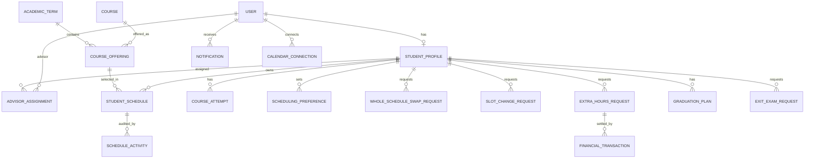

# Data Model

This is the MongoDB persistence layer for the full 128-item functional requirements sheet. It defines Mongoose schemas and indexes only; it does not implement pages, API routes, authorization, workflow services, migrations, or seed data.

## Models

| Model | Purpose |
| --- | --- |
| `User` | Login identity, role, active state, and password hash. Email domain is validated against role; signup is not part of the requirements. |
| `StudentProfile` | Student ID, type, major, semester, standing, enrollment state, advising reason, and current advisor. Kept separate so staff accounts do not carry student-only fields. |
| `AdvisorAssignment` | Appendable assignment history; the partial unique index allows only one current advisor assignment per student. |
| `PasswordResetToken` | Stores only a token hash, use time, and expiry; expired tokens are removed by MongoDB's TTL index. |
| `NotificationPreference` | Per-user in-app/email switches and muted event categories. |
| `AcademicTerm` | Term dates, registration/advising deadlines, season, and academic year. |
| `Course` | Catalogue data, credit hours, type, majors, seasons, prerequisite references, and bachelor-project marker. |
| `CourseOffering` | A course in a term, instructor name/email snapshots, eligible groups, publication state, and lecture/tutorial/lab slots. Slot groups are embedded because their details belong to one offering. |
| `ScheduleTemplate` | Published standard schedule for a term, major, semester, and study group. |
| `StudentSchedule` | Normal or advising schedule, its workflow status/version, course selections, and selected offering slot IDs. |
| `CourseAttempt` | Course history and transcript results, including makeup attempts and attendance state. |
| `SchedulingPreference` | Ranked preferred/avoided days, time ranges, groups, and days off for a student and term. |
| `StudentWorkflowState` | Computed per-student/per-term status and blocking step for coordinator dashboards. It is a projection, not an advisor-editable source of truth. |
| `WholeScheduleSwapRequest` | Group-based swap request, eligible group choices, course-set snapshot, expiry, and completion state. |
| `SlotChangeRequest` | Advising student's requested slot change, current/replacement slot IDs, decision, and response. |
| `MandatoryCourseRemovalRequest` | Advisor request and coordinator decision for removing a mandatory course. |
| `ExtraHoursRequest` | Requested courses/hours, eligibility snapshot, itemized cost, coordinator decision, and settlement state. |
| `FinancialTransaction` | Append-only wallet, gateway, deferred-charge, refund, and cancellation ledger. Wallet balance is derived from successful entries. |
| `GraduationPlan` | Private advisor draft or submitted plan, with courses assigned to future terms and coordinator decision. |
| `ExitExamRequest` | Request and decision for an exit exam tied to a remaining failed course. |
| `Notification` | In-app/email event, delivery/read state, and related record pointer. |
| `ScheduleActivity` | Processing/reopening audit event with actor identity snapshots so history remains readable later. |
| `CalendarConnection` | OAuth provider account and encrypted token fields; there is deliberately no calendar-password field. |

## Relationships

The model files are grouped by responsibility: `identity.js`, `catalogue.js`, `academics.js`, `requests.js`, `finance.js`, and `communications.js`. `models/index.js` re-exports them for API code.

## Requirement Coverage

- Requirements 1-15: users, student profiles, advisor assignments, reset tokens, and student-directory indexes.
- Requirements 16-30: academic terms, catalogue courses, offerings/slots, templates, and schedule assignments.
- Requirements 31-61: student schedules, swaps, slot changes, academic history, preferences, and mandatory-course candidates.
- Requirements 62-82: advising schedule drafts, review/processing states, and mandatory-course removal decisions.
- Requirements 83-102: extra-hours requests, wallet/payment/deferred-charge ledger entries, refunds, and financial search indexes.
- Requirements 103-115: graduation plans and exit-exam requests/decisions.
- Requirements 116-128: calendar connections, notifications, computed workflow dashboard state, and schedule activity history. CSV import remains an all-or-nothing API operation; it does not need a permanent import collection.

## Important Boundaries

Mongoose validates individual documents and the indexes prevent selected duplicate records. Cross-document rules still belong in API services and MongoDB transactions: seat-capacity changes, two-sided schedule swaps, role visibility, deadlines, prerequisite/credit-hour decisions, one-time financial reversals, and all-or-nothing CSV imports. Those rules cannot be guaranteed by a schema alone.

`StudentWorkflowState` is a dashboard-friendly projection and must be recomputed from source schedules and requests. Calendar tokens must be encrypted before writing these fields; the model does not perform encryption. Store payment-provider references and outcomes only, never card numbers, CVVs, or gateway passwords.
